# astro-gallery


Folder-driven image galleries for [Astro](https://astro.build) — a justified
layout, a responsive grid with an optional masonry variant, an editorial
reader, a glass-caption slideshow, a fanned-print carousel, an EXIF-date
timeline, and a GDPR-friendly photo map. Every image goes through
`astro:assets` (optimised, correctly-sized `webp`/`avif` with `srcset`), and
every component ships semantic HTML, native lazy loading, resolved `alt` text
and `ImageGallery` JSON-LD out of the box.

Point a component at a folder in `src/`, drop your photos in, done:

```astro
<JustifiedGallery folderPath="trips/rome" album="Rome, 2024" />
<ImageGallery folderPath="trips/rome" columns={4} />
<EditorialGallery folderPath="trips/rome" album="Rome, 2024" />
<SlideshowGallery folderPath="trips/rome" album="Rome, 2024" />
<CarouselGallery folderPath="trips/rome" album="Rome, 2024" />
<ImageTimeline folderPath="trips/rome" />
<MapGallery folderPath="trips/rome" />
```

| Component          | What it does                                                                                                                                                                                             |
| ------------------ | -------------------------------------------------------------------------------------------------------------------------------------------------------------------------------------------------------- |
| `JustifiedGallery` | Aspect-ratio-aware rows that fill the width edge-to-edge (Flickr/Unsplash style). Responsive `srcset`, blur-up skeletons, `content-visibility`, JSON-LD. Zero layout JS.                                 |
| `ImageGallery`     | Uniform responsive CSS grid, click to open a lightbox with arrow-key navigation. A scroll-triggered entrance, a zoom-in affordance, and an opt-in `variant="masonry"` that keeps each photo's own ratio. |
| `EditorialGallery` | The justified layout with a two-pane fullscreen reader: photo left, caption panel right (title, caption, date, camera, place, pixel size), filmstrip, collapsible panel.                                 |
| `SlideshowGallery` | One photo at a time on a translate-driven track, with a glassmorphism caption card that rises on hover or focus. Pointer drag, keyboard, dots, optional autoplay with a pause control.                   |
| `CarouselGallery`  | A fanned stack of prints: the centre photo full-size, neighbours peeking in perspective. Click a peek, drag, or use the arrows; the caption docks below the stage instead of riding on the photo.        |
| `ImageTimeline`    | Reads each photo's EXIF capture date, groups by day and lays the days out on a timeline — a horizontal scrolling rail or a vertical spine (`<ol>` + `<time>`). Optional reverse-geocoded location label. |
| `MapGallery`       | Reads GPS EXIF, drops a circular photo marker per location on a Leaflet map. Consent gate, so no external tile request happens before the visitor agrees; crawlable fallback.                            |

---

## Installation

```bash
npm install astro-gallery
```

`astro`, `leaflet` and `exifr` are the only runtime pieces — `leaflet` and
`exifr` are bundled as dependencies, `astro` is a peer dependency (`>=4`).

### Add the integration

```js
// astro.config.mjs
import { defineConfig } from 'astro/config';
import gallery from 'astro-gallery';

export default defineConfig({
  integrations: [
    gallery({
      // all optional — these are the defaults
      imagesDir: 'assets/images',
      locale: 'en-US',
      thumbWidth: 800,
      fullWidth: 1600,
      imageFormat: 'webp',
    }),
  ],
});
```

The integration exposes the resolved config to the components through a virtual
module; the components will not work without it.

### TypeScript

Add the virtual-module types to `src/env.d.ts` (or any `.d.ts` in your project):

```ts
/// <reference types="astro-gallery/components/virtual.d.ts" />
```

This is only needed if you import the components in `.ts`/`.tsx`; `.astro` and
`.mdx` files work without it.

---

## Usage

Import the components from `astro-gallery/components/…`:

```astro
---
import JustifiedGallery from 'astro-gallery/components/JustifiedGallery.astro';
import ImageGallery from 'astro-gallery/components/ImageGallery.astro';
import EditorialGallery from 'astro-gallery/components/EditorialGallery.astro';
import SlideshowGallery from 'astro-gallery/components/SlideshowGallery.astro';
import CarouselGallery from 'astro-gallery/components/CarouselGallery.astro';
import ImageTimeline from 'astro-gallery/components/ImageTimeline.astro';
import MapGallery from 'astro-gallery/components/MapGallery.astro';
---
```

In MDX the same imports work at the top of the file.

### `JustifiedGallery`

The modern one. Rows are justified to the container width using each image's
aspect ratio, so nothing is cropped to a fixed grid cell. Built for Core Web
Vitals: `srcset`/`sizes`, intrinsic `width`/`height` (no CLS), `content-visibility`
to skip offscreen work, blur-up skeletons, and the first images marked
`fetchpriority="high"`.

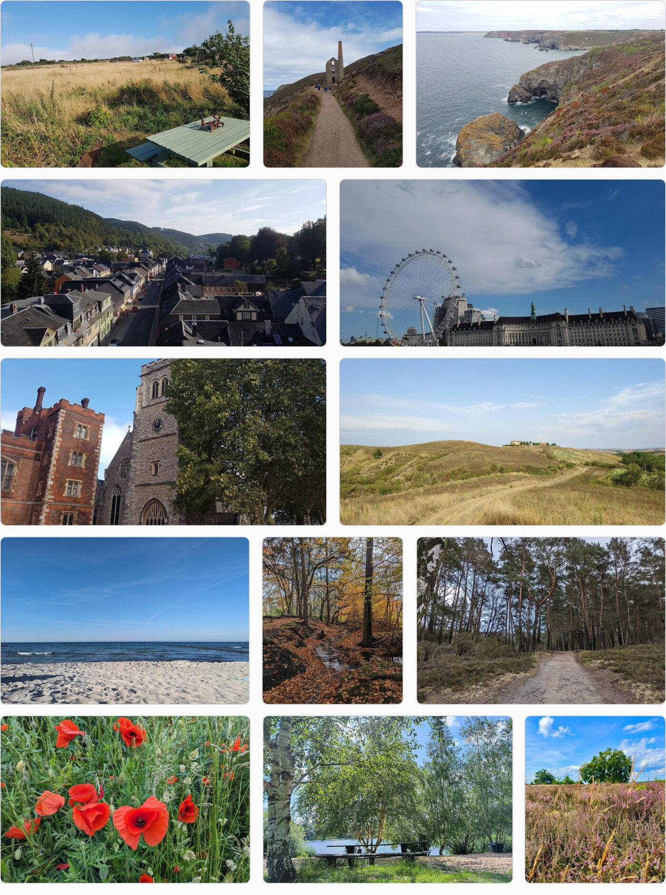

```astro
<JustifiedGallery
  folderPath="trips/rome"
  album="Rome, 2024"
  rowHeight={280}
  alt={{ 'piazza-navona.jpg': 'Fountain of the Four Rivers at dusk' }}
/>
```

| Prop             | Type                        | Default              | Notes                                                                |
| ---------------- | --------------------------- | -------------------- | -------------------------------------------------------------------- |
| `folderPath`     | `string`                    | –                    | Folder relative to `src/<imagesDir>/`.                               |
| `images`         | `{ src, alt?, caption? }[]` | –                    | Use instead of `folderPath` (imported image, `/public` path or URL). |
| `baseDir`        | `string`                    | `imagesDir`          | Override the base folder.                                            |
| `rowHeight`      | `number`                    | `260`                | Target row height in px (rows justify to fill the width).            |
| `gap`            | `string`                    | `1rem`               | CSS gap between items.                                               |
| `eager`          | `number`                    | `2`                  | First N images load eagerly with `fetchpriority="high"`.             |
| `lightbox`       | `boolean`                   | `true`               | Open images in the built-in lightbox.                                |
| `alt`            | `Record<string,string>`     | `{}`                 | Per-file `alt` overrides (folder mode), keyed by file name.          |
| `captions`       | `Record<string,string>`     | `{}`                 | Per-file caption overrides (folder mode).                            |
| `album`          | `string`                    | –                    | Accessible label, fallback `alt`, and JSON-LD `name`.                |
| `sizes`          | `string`                    | `1–3 col responsive` | `` attribute.                                             |
| `structuredData` | `boolean`                   | integration setting  | Emit `ImageGallery` JSON-LD.                                         |

### `ImageGallery`

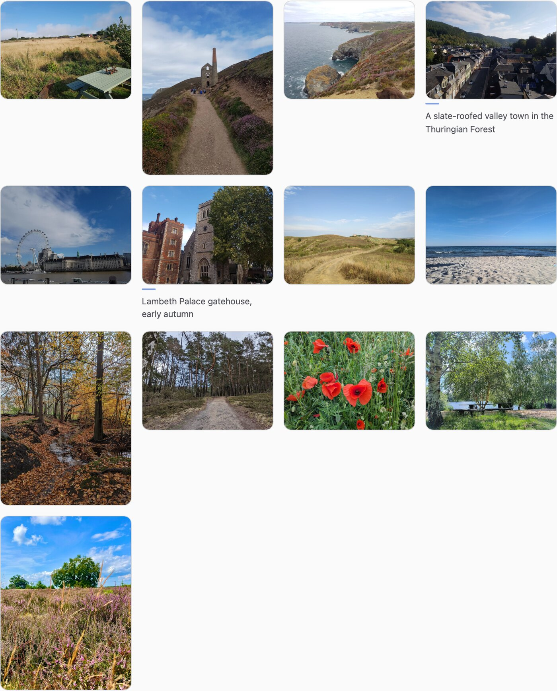

Click any image for the built-in lightbox — arrow keys, `Esc`, and the caption
carried through:

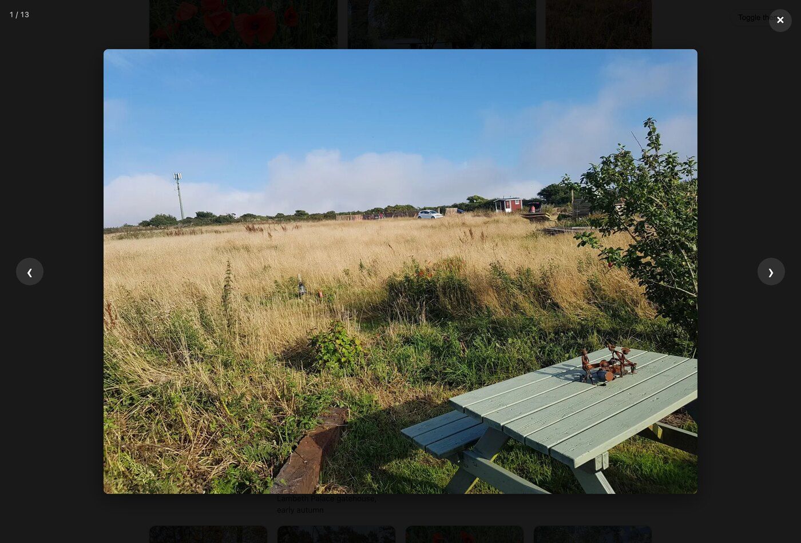

Cells rise into place as they cross the viewport (one pass, skipped entirely
under `prefers-reduced-motion`), and hovering or focusing a photo lifts it,
scales the image and raises a zoom-in cue — a clearer affordance than
`cursor: zoom-in` alone, and one that also shows up for keyboard focus.

**Folder mode** — every image in `src/assets/images/trips/rome/`, sorted by
filename (natural sort, so `2.jpg` before `10.jpg`):

```astro
<ImageGallery folderPath="trips/rome" columns={3} />
```

**`variant="masonry"`** keeps each photo's own aspect ratio instead of
cropping every cell to the same rectangle, packing the columns tight
(CSS Grid row-spans, `grid-auto-flow: dense` to backfill gaps — no JS layout
pass). The caption moves to a hover scrim riding on the image, since there's
no uniform cell to put a `<figcaption>` under:

```astro
<ImageGallery folderPath="trips/rome" columns={4} variant="masonry" />
```

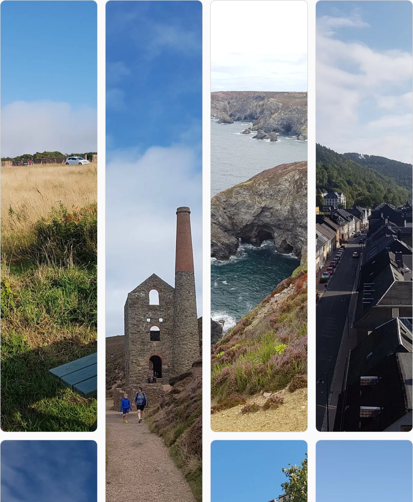

**Explicit mode** — mix `import`ed images, `/public` paths and remote URLs, and
add captions:

```astro
---
import sunrise from '../assets/sunrise.jpg';
---

<ImageGallery
  columns={2}
  images={[
    { src: sunrise, alt: 'Sunrise over the forum', caption: 'Day 1 — 05:41' },
    { src: '/photos/street.jpg', alt: 'Backstreet' },
    { src: 'https://example.com/remote.jpg', alt: 'Remote host' },
  ]}
/>
```

| Prop             | Type                        | Default     | Notes                                                                               |
| ---------------- | --------------------------- | ----------- | ----------------------------------------------------------------------------------- |
| `folderPath`     | `string`                    | –           | Folder relative to `src/<imagesDir>/`.                                              |
| `images`         | `{ src, alt?, caption? }[]` | –           | Use instead of `folderPath`. `src` is an imported image, a `/public` path or a URL. |
| `baseDir`        | `string`                    | `imagesDir` | Override the base folder for this instance.                                         |
| `columns`        | `1 \| 2 \| 3 \| 4 \| 5`     | `3`         | Columns at the widest breakpoint (scales down responsively).                        |
| `variant`        | `'grid' \| 'masonry'`       | `'grid'`    | `'masonry'` keeps each photo's own ratio instead of cropping to a uniform cell.     |
| `gap`            | `string`                    | `1rem`      | CSS gap between items.                                                              |
| `loading`        | `'lazy' \| 'eager'`         | `'lazy'`    | `loading` for images after the first (the first is always `eager`).                 |
| `lightbox`       | `boolean`                   | `true`      | `false` → thumbnails link straight to the full image.                               |
| `alt`            | `Record<string,string>`     | `{}`        | Per-file `alt` overrides (folder mode), keyed by file name.                         |
| `captions`       | `Record<string,string>`     | `{}`        | Per-file caption overrides (folder mode).                                           |
| `album`          | `string`                    | –           | Accessible label, fallback `alt`, and JSON-LD `name`.                               |
| `sizes`          | `string`                    | from cols   | `` attribute.                                                            |
| `structuredData` | `boolean`                   | integ.      | Emit `ImageGallery` JSON-LD.                                                        |

Without JavaScript the thumbnails are still plain links to the full-size image.

### `EditorialGallery`

The same justified rows as `JustifiedGallery`, but clicking a photo opens a
two-pane reader instead of a plain lightbox: the picture on the left, a caption
panel on the right. The panel carries the title, the caption and the EXIF facts
— capture date, camera, reverse-geocoded place and the source pixel size — all
resolved at build time. Behind it sits a heavily blurred copy of the current
photo, so the panel glass takes on the picture's colour.

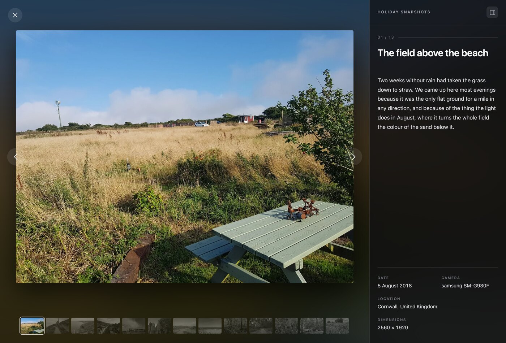

```astro
<EditorialGallery
  folderPath="trips/rome"
  album="Rome, 2024"
  titles={{ 'piazza-navona.jpg': 'Fountain of the Four Rivers' }}
  captions={{ 'piazza-navona.jpg': 'Bernini, 1651 — best an hour before sunset.' }}
/>
```

In the viewer: `←` / `→` and `Home` / `End` move, the filmstrip jumps, `Esc`
closes, swipe works on touch, and the button in the panel header collapses the
panel for a full-bleed view. Focus is trapped while it is open and restored to
the thumbnail you came from. Below 900px the panel becomes a bottom sheet.

Titles and captions fall back to embedded metadata when you do not pass an
override — IPTC `ObjectName` / XMP `dc:title` for the title, and the same
description tags [`captions`](#captions) uses for the body. A photo with neither
just shows its `alt` as the title.

| Prop             | Type                                | Default              | Notes                                                            |
| ---------------- | ----------------------------------- | -------------------- | ---------------------------------------------------------------- |
| `folderPath`     | `string`                            | –                    | Folder relative to `src/<imagesDir>/`.                           |
| `images`         | `{ src, alt?, title?, caption? }[]` | –                    | Use instead of `folderPath`. No EXIF facts in this mode.         |
| `baseDir`        | `string`                            | `imagesDir`          | Override the base folder.                                        |
| `rowHeight`      | `number`                            | `280`                | Target row height in px.                                         |
| `gap`            | `string`                            | `1rem`               | CSS gap between items.                                           |
| `eager`          | `number`                            | `2`                  | First N images load eagerly with `fetchpriority="high"`.         |
| `alt`            | `Record<string,string>`             | `{}`                 | Per-file `alt` overrides (folder mode).                          |
| `captions`       | `Record<string,string>`             | `{}`                 | Per-file caption overrides (folder mode).                        |
| `titles`         | `Record<string,string>`             | `{}`                 | Per-file panel-title overrides (folder mode).                    |
| `album`          | `string`                            | –                    | Panel eyebrow, accessible label, fallback `alt`, JSON-LD `name`. |
| `locale`         | `string`                            | integration setting  | Formats the capture date and resolves `labels`.                  |
| `geocode`        | `boolean`                           | integration setting  | Reverse-geocode the place name shown in the panel.               |
| `showMeta`       | `boolean`                           | `true`               | Show the date / camera / place / size block at all.              |
| `sizes`          | `string`                            | `1–3 col responsive` | `` attribute.                                         |
| `structuredData` | `boolean`                           | integration setting  | Emit `ImageGallery` JSON-LD.                                     |
| `labels`         | `EditorialLabelOptions`             | English              | Viewer UI strings — see below.                                   |

`labels` retitles the panel's own copy. Every entry takes a string or a
[locale dictionary](#multi-language-text):

```astro
<EditorialGallery
  folderPath="trips/rome"
  locale="de-DE"
  labels={{
    date: 'Aufnahme',
    location: 'Ort',
    camera: 'Kamera',
    dimensions: 'Größe',
    close: 'Schließen',
    previous: 'Vorheriges Foto',
    next: 'Nächstes Foto',
    showDetails: 'Details einblenden',
    hideDetails: 'Details ausblenden',
  }}
/>
```

The viewer keeps its own dark palette regardless of the page theme. Retheme it
through the `--eglb-*` custom properties on `.asg-eglb` — `--eglb-panel-w`,
`--eglb-bg`, `--eglb-glass`, `--eglb-text`, `--eglb-body`, `--eglb-muted`,
`--eglb-faint` and `--eglb-line`.

### `SlideshowGallery`

One photo at a time on a track that is moved with a single `translate3d()` —
never a width or a margin — so slide changes stay on the compositor. The easing
is an expo-out curve (`cubic-bezier(0.16, 1, 0.3, 1)`) over 720ms, so a slide
starts fast and settles slowly.

The caption is a glassmorphism card (`backdrop-filter: blur(22px) saturate(180%)`)
inset from the stage, which floats up and fades in when you hover or focus the
current slide.

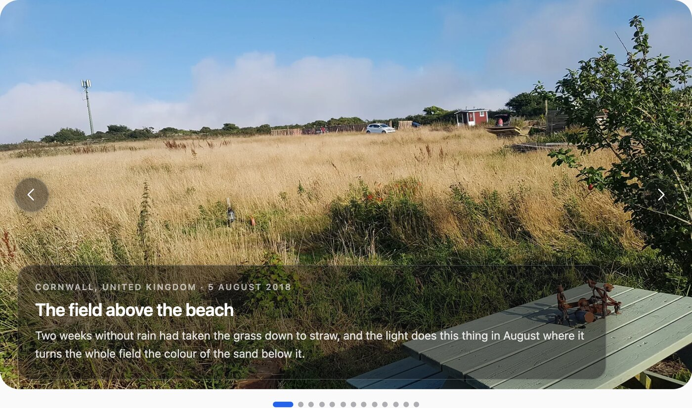

```astro
<SlideshowGallery
  folderPath="trips/rome"
  album="Rome, 2024"
  aspectRatio="16 / 9"
  titles={{ 'piazza-navona.jpg': 'Fountain of the Four Rivers' }}
  captions={{ 'piazza-navona.jpg': 'Bernini, 1651 — best an hour before sunset.' }}
/>
```

Drag it with a pointer and the track follows 1:1, then settles on the same
curve; a drag past 15% of the stage changes slide. `←` / `→` / `Home` / `End`
work once the slideshow has focus, off-screen slides are `inert` (out of the
tab order and the a11y tree), and a polite live region announces `"3 of 13"`.

| Prop                          | Type                                | Default             | Notes                                                                                                        |
| ----------------------------- | ----------------------------------- | ------------------- | ------------------------------------------------------------------------------------------------------------ |
| `folderPath`                  | `string`                            | –                   | Folder relative to `src/<imagesDir>/`.                                                                       |
| `images`                      | `{ src, alt?, title?, caption? }[]` | –                   | Use instead of `folderPath`. No EXIF facts in this mode.                                                     |
| `aspectRatio`                 | `string`                            | `"16 / 10"`         | CSS aspect ratio for the stage.                                                                              |
| `radius`                      | `string`                            | `"24px"`            | Corner radius of the stage.                                                                                  |
| `fit`                         | `"cover" \| "contain"`              | `"cover"`           | `contain` shows the whole frame and fills the letterbox with a blurred copy — use it for mixed orientations. |
| `captionMode`                 | `"hover" \| "always" \| "none"`     | `"hover"`           | When the glass card shows. Always visible on touch.                                                          |
| `autoplay`                    | `boolean`                           | `false`             | Adds a pause control. Never starts under reduced motion.                                                     |
| `interval`                    | `number`                            | `6000`              | Autoplay delay in ms (min 1500).                                                                             |
| `loop`                        | `boolean`                           | `true`              | Wrap past the ends. `false` disables the arrows at the extremes.                                             |
| `dots`                        | `boolean`                           | `true`              | Render the dot indicators.                                                                                   |
| `showMeta`                    | `boolean`                           | `true`              | Place / capture date line in the card.                                                                       |
| `geocode`                     | `boolean`                           | integration setting | Reverse-geocode the place name.                                                                              |
| `eager`                       | `number`                            | `1`                 | First N slides load eagerly.                                                                                 |
| `alt` / `captions` / `titles` | `Record<string,string>`             | `{}`                | Per-file overrides (folder mode).                                                                            |
| `album`                       | `string`                            | –                   | Accessible label, fallback `alt`, JSON-LD `name`.                                                            |
| `locale`                      | `string`                            | integration setting | Formats the capture date, resolves `labels`.                                                                 |
| `sizes`                       | `string`                            | full-width stage    | `` attribute.                                                                                     |
| `structuredData`              | `boolean`                           | integration setting | Emit `ImageGallery` JSON-LD.                                                                                 |
| `labels`                      | `SlideshowLabelOptions`             | English             | `previous`, `next`, `play`, `goToSlide` (`{n}` is the number).                                               |

Retheme through the custom properties on `.asg-slides`: `--asg-slides-duration`,
`--asg-slides-ease`, `--asg-slides-radius`, `--asg-slides-ar`,
`--asg-slides-glass`, `--asg-slides-hairline`, `--asg-slides-chip` and
`--asg-slides-chip-hover`.

Under `prefers-reduced-motion` the track transition, the card's rise and the
control hover transforms are all dropped, and autoplay never starts.

### `CarouselGallery`

A fanned stack of prints rather than a single full-bleed frame: the centre
photo sits at full size, its neighbours peek at the edges — scaled down,
dimmed and tilted in perspective by how far they sit from the centre. Click a
peeking print, drag, or use the arrows to bring it forward.

The caption docks in its own strip below the stage and crossfades as the
centre print changes, instead of riding on the photo the way
`SlideshowGallery`'s glass card does — so it never competes with the image.

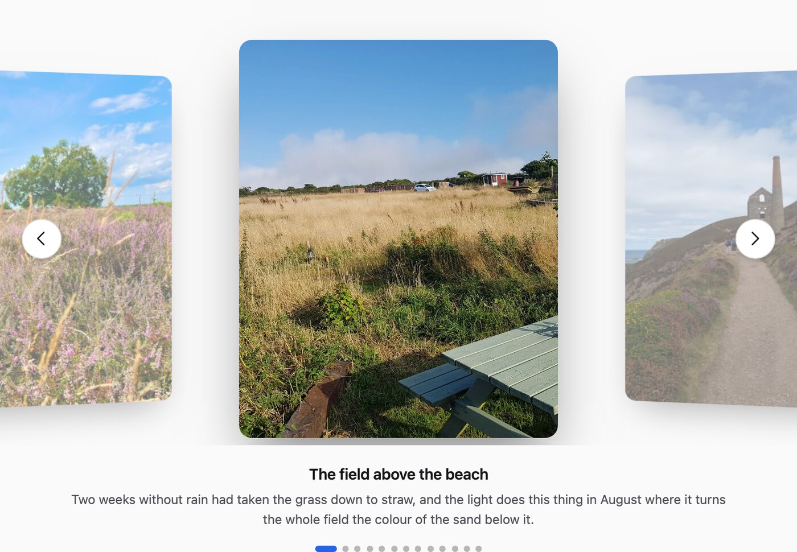

```astro
<CarouselGallery
  folderPath="trips/rome"
  album="Rome, 2024"
  titles={{ 'piazza-navona.jpg': 'Fountain of the Four Rivers' }}
  captions={{ 'piazza-navona.jpg': 'Bernini, 1651 — best an hour before sunset.' }}
/>
```

Every card is positioned from its own distance to the centre (the _wrapped_
distance, so with `loop` on, the last photo correctly peeks to the left of the
first) rather than from DOM order — a shared single track transform, the way
`SlideshowGallery` centres its one full-bleed slide, can't loop a multi-card
fan correctly. `←` / `→` / `Home` / `End` work once the carousel has focus, and
a polite live region announces `"3 of 13"`.

| Prop                          | Type                                | Default             | Notes                                                  |
| ----------------------------- | ----------------------------------- | ------------------- | ------------------------------------------------------ |
| `folderPath`                  | `string`                            | –                   | Folder relative to `src/<imagesDir>/`.                 |
| `images`                      | `{ src, alt?, title?, caption? }[]` | –                   | Use instead of `folderPath`.                           |
| `cardAspectRatio`             | `string`                            | `"4 / 5"`           | CSS aspect ratio for each print.                       |
| `loop`                        | `boolean`                           | `true`              | Wrap past the ends.                                    |
| `autoplay`                    | `boolean`                           | `false`             | Never starts under reduced motion.                     |
| `interval`                    | `number`                            | `5000`              | Autoplay delay in ms (min 1500).                       |
| `dots`                        | `boolean`                           | `true`              | Render the dot indicators.                             |
| `eager`                       | `number`                            | `1`                 | First N photos load eagerly.                           |
| `alt` / `captions` / `titles` | `Record<string,string>`             | `{}`                | Per-file overrides (folder mode).                      |
| `album`                       | `string`                            | –                   | Accessible label, fallback `alt`, JSON-LD `name`.      |
| `locale`                      | `string`                            | integration setting | Resolves `labels`.                                     |
| `sizes`                       | `string`                            | card's own width    | `` attribute.                               |
| `structuredData`              | `boolean`                           | integration setting | Emit `ImageGallery` JSON-LD.                           |
| `labels`                      | `CarouselLabelOptions`              | English             | `previous`, `next`, `goToSlide` (`{n}` is the number). |

Retheme through the custom properties on `.asg-carousel`: `--asg-car-ar`,
`--asg-car-card-w`, `--asg-car-duration`, `--asg-car-ease` and
`--asg-car-radius`.

Under `prefers-reduced-motion` the card and nav transitions are dropped
(navigation is instant) and autoplay never starts.

### `ImageTimeline`

Groups photos by EXIF capture day. `orientation="horizontal"` (the default) lays
the days out on a rail you scroll sideways:

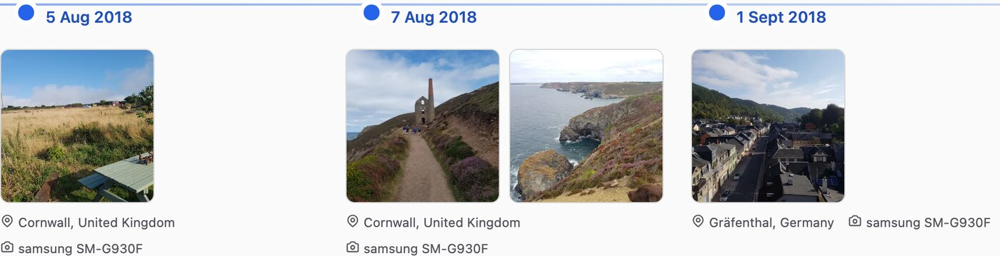

`orientation="vertical"` stacks them down the page on a left-hand spine:

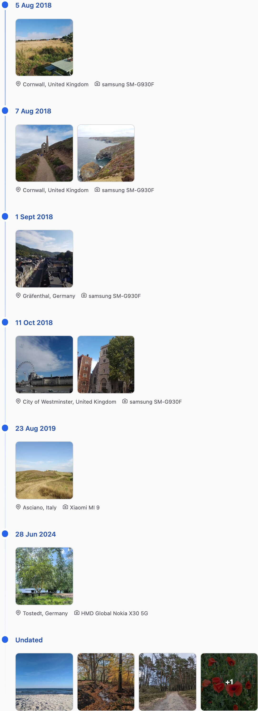

```astro
<ImageTimeline folderPath="trips/rome" maxPerGroup={4} />
<ImageTimeline folderPath="trips/rome" orientation="vertical" />
```

| Prop           | Type                         | Default              | Notes                                                         |
| -------------- | ---------------------------- | -------------------- | ------------------------------------------------------------- |
| `folderPath`   | `string`                     | – (required)         | Folder relative to `src/<imagesDir>/`.                        |
| `baseDir`      | `string`                     | `imagesDir`          | Override the base folder.                                     |
| `locale`       | `string`                     | integration `locale` | Date-label locale.                                            |
| `maxPerGroup`  | `number`                     | `4`                  | Thumbnails per day before a `+N` tile.                        |
| `orientation`  | `'horizontal' \| 'vertical'` | `'horizontal'`       | Horizontal scrolling rail, or a vertical spine down the page. |
| `geocode`      | `boolean`                    | integration setting  | Reverse-geocode one location label per day.                   |
| `scrollHint`   | `string \| LocalizedText`    | `'Scroll for more'`  | Hint under a **horizontal** timeline; `""` hides it.          |
| `undatedLabel` | `string \| LocalizedText`    | integration setting  | Label for the trailing group of dateless photos.              |
| `alt`          | `Record<string,string>`      | `{}`                 | Per-file `alt` overrides, keyed by file name.                 |
| `album`        | `string`                     | –                    | Accessible label and fallback `alt`.                          |

Photos with no EXIF date collapse into a single trailing group (label
configurable via the integration's `undatedLabel`).

### `MapGallery`

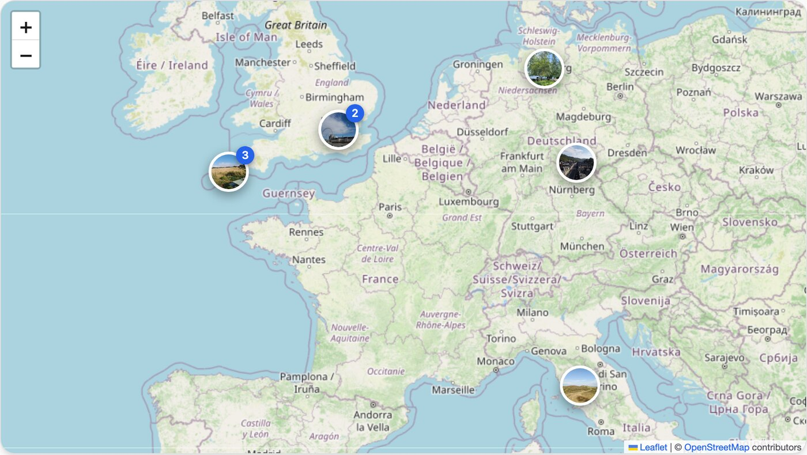

Markers closer than ~52px at the current zoom collapse into one counted pin;
clicking it zooms to the group.

```astro
<MapGallery folderPath="trips/rome" />
```

Images without GPS EXIF are silently skipped; if none of the photos have GPS
the component renders nothing.

| Prop                                                  | Type                      | Default                     | Notes                                                    |
| ----------------------------------------------------- | ------------------------- | --------------------------- | -------------------------------------------------------- |
| `folderPath`                                          | `string`                  | – (required)                | Folder relative to `src/<imagesDir>/`.                   |
| `baseDir`                                             | `string`                  | `imagesDir`                 | Override the base folder.                                |
| `locale`                                              | `string`                  | integration `locale`        | Popup date locale.                                       |
| `geocode`                                             | `boolean`                 | integration setting         | Reverse-geocode a label per marker.                      |
| `basemap`                                             | `BasemapId`               | `'osm'`                     | Named tile preset (see below).                           |
| `scheme`                                              | `'auto'\|'light'\|'dark'` | `'auto'`                    | Force the control chrome light/dark, or follow the page. |
| `tileUrl`                                             | `string`                  | from `basemap`              | Leaflet XYZ tile template; overrides `basemap`.          |
| `tileAttribution`                                     | `string`                  | from `basemap`              | Attribution HTML.                                        |
| `tileApiKey`                                          | `string`                  | –                           | Key appended to tile requests (CARTO, Stadia…).          |
| `tileApiKeyParam`                                     | `string`                  | `api_key`                   | Query-param name for `tileApiKey`.                       |
| `consent`                                             | `boolean`                 | `true`                      | Show the consent gate before loading tiles.              |
| `consentKey`                                          | `string`                  | `astro-gallery:map-consent` | `localStorage` key for the choice.                       |
| `consentTitle` / `consentText` / `consentButtonLabel` | `string \| LocalizedText` | English defaults            | Consent gate copy (`consentText` allows HTML).           |
| `alt`                                                 | `Record<string,string>`   | `{}`                        | Per-file `alt` overrides, keyed by file name.            |
| `album`                                               | `string`                  | –                           | Accessible label, fallback `alt`, JSON-LD name.          |
| `structuredData`                                      | `boolean`                 | integration setting         | Emit `ImageGallery` JSON-LD.                             |

Even with the map, an SSR-rendered `<ul>` of linked thumbnails (with `alt`,
`width`/`height` and `loading="lazy"`) sits inside the container for crawlers and
no-JS visitors; the client script removes it once the interactive map is built.

#### The consent gate

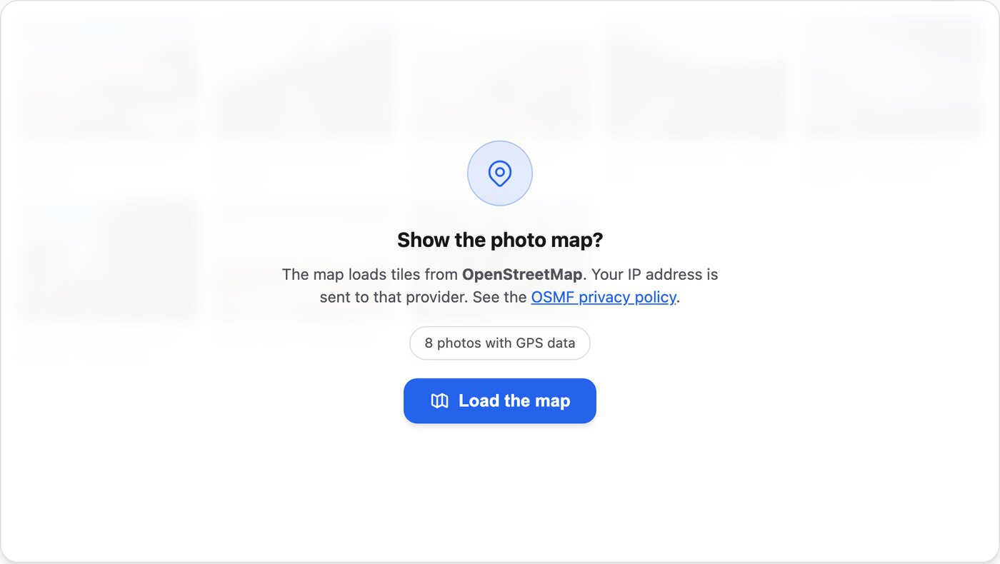

Map tiles are fetched from a third-party CDN, which exposes the visitor's IP
address. By default `MapGallery` renders an overlay explaining this and loads
nothing from the network until the visitor clicks the button. The decision
is stored in `localStorage` under `consentKey`. Set `consent={false}` (or
`map.consent: false` on the integration) to opt out of the gate — e.g. if you
self-host tiles.

#### Basemap themes

Pick a look with `basemap` (integration `map.basemap` or the `MapGallery` prop) —
it fills in the tile URL, attribution, zoom and control-chrome scheme:

| `basemap`         | Style                      | Chrome | Key? |
| ----------------- | -------------------------- | ------ | ---- |
| `osm` _(default)_ | OSM standard               | light  | no   |
| `carto-dark`      | CARTO dark matter          | dark   | yes  |
| `carto-light`     | CARTO positron             | light  | yes  |
| `carto-voyager`   | CARTO voyager              | light  | yes  |
| `stadia-dark`     | Stadia Alidade Smooth Dark | dark   | yes  |
| `esri-satellite`  | Esri world imagery         | dark   | no   |

```js
// astro.config.mjs
gallery({
  map: {
    basemap: 'carto-dark',
    tileApiKey: process.env.CARTO_API_KEY, // free key: https://carto.com/basemaps/apikey/
  },
});
```

```astro
<!-- or per instance -->
<MapGallery folderPath="trips/rome" basemap="esri-satellite" />
```

The preset also sets `scheme` (`"light"` / `"dark"`) so the popups, zoom buttons
and attribution match the tiles even on a page with the opposite theme. Override
with the `scheme` prop, or `"auto"` to follow the page.

#### Custom tile providers & API keys

`tileUrl` overrides any `basemap`. `tileApiKey` is appended to every tile request
as `?<tileApiKeyParam>=<key>` — default param `api_key` (CARTO, Stadia); MapTiler
uses `key`, Thunderforest `apikey`.

```js
gallery({
  map: {
    tileUrl: 'https://api.maptiler.com/maps/streets-v2/{z}/{x}/{y}.png',
    tileApiKey: process.env.MAPTILER_KEY,
    tileApiKeyParam: 'key',
    tileAttribution: '&copy; MapTiler &copy; OpenStreetMap contributors',
  },
});
```

Tile keys are requested from the browser, so use a **domain-restricted** key — it
will be visible in page source.

#### Content Security Policy

Tiles load as `` from the provider's CDN, so a strict `img-src` policy will
block them. Allow the host for the `basemap` you use (add `data:` for the SSR
fallback thumbnails, which are `astro:assets` output and covered by `'self'`):

| `basemap`         | `img-src` host to allow                                           |
| ----------------- | ----------------------------------------------------------------- |
| `osm` _(default)_ | `https://*.tile.openstreetmap.org https://tile.openstreetmap.org` |
| `carto-*`         | `https://*.basemaps.cartocdn.com`                                 |
| `stadia-dark`     | `https://tiles.stadiamaps.com`                                    |
| `esri-satellite`  | `https://server.arcgisonline.com`                                 |

For a custom `tileUrl`, allow that provider's tile host.

---

## Captions

Captions render as a `<figcaption>` — always visible under the photo in
`ImageGallery`'s default grid, revealed on hover/focus in `JustifiedGallery`,
`EditorialGallery` and `ImageGallery`'s `variant="masonry"` — and also feed the
lightbox caption and the JSON-LD `caption`. In `EditorialGallery` the caption
is the panel's body text; in `SlideshowGallery` it's the glass card that rises
over the photo; in `CarouselGallery` it's a docked strip below the stage that
crossfades as the centre print changes. Three ways to set them:

**Folder mode — the `captions` prop** (`JustifiedGallery`, `ImageGallery`,
`EditorialGallery`, `SlideshowGallery`, `CarouselGallery`). A map of _file
name_ → caption; files you omit have none:

```astro
<JustifiedGallery
  folderPath="trips/rome"
  captions={{
    '05-piazza-navona.jpg': 'The Fountain of the Four Rivers at dusk',
    '09-gianicolo-sunset.jpg': 'Golden hour from the Gianicolo hill',
  }}
/>
```

**Explicit mode — the `caption` field** on each entry:

```astro
<ImageGallery
  images={[
    { src: navona, alt: 'Fountain of the Four Rivers', caption: 'Day 2 — Piazza Navona at dusk' },
    { src: '/photos/street.jpg', alt: 'A quiet backstreet' },
  ]}
/>
```

**Embedded in the file.** `JustifiedGallery` (folder mode) falls back to an
image's own IPTC / XMP caption when it has one and it differs from the `alt`.
Set it with any photo app's _Caption_ field, or exiftool:

```bash
exiftool -IPTC:Caption-Abstract="Golden hour from the Gianicolo hill" 09-sunset.jpg
```

The `captions` prop always wins over an embedded caption. `JustifiedGallery`
captions are hidden until hover/focus — to always show them, add
`.asg-jgallery__caption { opacity: 1 }` to your CSS.

`ImageTimeline` and `MapGallery` don't take per-photo captions; they show the
reverse-geocoded location (and date) instead.

---

## Integration options

```ts
gallery({
  imagesDir: 'assets/images', // folderPath is resolved against src/<this>/
  locale: 'en-US', // every date label
  thumbWidth: 800, // px, passed to astro:assets
  fullWidth: 1600, // px, the "full" image behind the lightbox
  imageFormat: 'webp', // 'webp' | 'avif' | 'jpeg' | 'png'
  undatedLabel: 'Undated',
  responsiveWidths: [400, 640, 960, 1280, 1920], // srcset candidate widths
  structuredData: true, // emit ImageGallery / ImageObject JSON-LD

  map: {
    basemap: 'osm', // 'osm' | 'carto-dark' | 'carto-light' | 'carto-voyager' | 'stadia-dark' | 'esri-satellite'
    scheme: 'auto', // 'auto' | 'light' | 'dark' — control-chrome colour
    // tileUrl / tileAttribution / subdomains / maxZoom come from `basemap`;
    // set them here to override the preset.
    tileApiKey: undefined, // required by carto-* / stadia-dark (and MapTiler, …)
    tileApiKeyParam: 'api_key',
    consent: true,
    consentKey: 'astro-gallery:map-consent',
    consentTitle: 'Map view',
    consentText: 'Loading the map requests map tiles from an external provider…',
    consentButtonLabel: 'Load map',
  },

  geocode: {
    enabled: true,
    endpoint: 'https://nominatim.openstreetmap.org/reverse',
    userAgent: 'astro-gallery (https://github.com/you/your-repo)',
    language: 'en',
    cachePath: '.cache/astro-gallery/geocode.json',
    minRequestIntervalMs: 1200,
  },
});
```

### Reverse geocoding & the cache

`ImageTimeline` and `MapGallery` turn GPS coordinates into place names at build
time using [Nominatim](https://nominatim.org/). Results are written to
`geocode.cachePath` (rounded to a ~11 km grid so nearby photos share a lookup).

**Commit that cache file.** Once it exists, builds — including CI — never touch
the network. Nominatim's [usage policy](https://operations.osmfoundation.org/policies/nominatim/)
asks for a real `User-Agent` and ≤ 1 request/second; the defaults respect this,
but set your own `userAgent`. To disable geocoding entirely: `geocode: { enabled: false }`.

### Multi-language text

Every user-facing string option accepts either a plain string or a
`LocalizedText` dictionary keyed by locale/language code:

```ts
gallery({
  locale: 'de-DE',
  undatedLabel: { 'de-DE': 'Undatiert', en: 'Undated' },
  map: {
    consentTitle: { de: 'Kartenansicht', en: 'Map view' },
    consentText: {
      de: 'Beim Laden der Karte werden Kartenkacheln von einem externen Anbieter geladen…',
      en: 'Loading the map requests map tiles from an external provider…',
    },
    consentButtonLabel: { de: 'Karte laden', en: 'Load map' },
  },
});
```

The entry is chosen against the component's **active `locale`** — the `locale`
prop if given, otherwise the integration's `locale`. On an
[i18n-routed](https://docs.astro.build/en/guides/internationalization/) site, pass
the current locale through:

```astro
<MapGallery folderPath="trips/rome" locale={Astro.currentLocale} />
<ImageTimeline folderPath="trips/rome" locale={Astro.currentLocale} />
```

Matching order: exact code (`de-DE`) → language (`de`) → any same-language entry →
a `default` / `*` key → the first entry. Comparison ignores case and `-`/`_`. The
same dictionaries work on the component props (`scrollHint`, `undatedLabel`,
`consentTitle` / `consentText` / `consentButtonLabel`).

---

## Theming

All markup is namespaced under `.asg-*` and driven by CSS custom properties. The
stylesheet loads automatically with the components. Override the tokens
anywhere in your global CSS:

```css
:root {
  --asg-accent: #e11d48;
  --asg-radius: 1rem;
  --asg-gap: 1.5rem;
  --asg-surface: #0b0b0f;
  --asg-border: rgba(255, 255, 255, 0.1);
  --asg-text: #fafafa;
  --asg-text-muted: #a1a1aa;
}
```

Light mode is picked up from `prefers-color-scheme` automatically. Force a mode
with `data-asg-theme="light"` / `"dark"` on `<html>`. You can also import the
stylesheet yourself (it is idempotent):

```astro
import 'astro-gallery/styles.css';
```

---

## SEO & accessibility

Every component renders crawlable, accessible markup on the server — the
JavaScript only enhances it.

- **Semantic HTML.** Galleries are a `<ul role="list">` of `<li><figure>`; each
  thumbnail is a real `<a href>` to the full-size image (so crawlers can follow
  it) with an `` and an optional `<figcaption>`. The timeline is a
  `<section>` containing an `<ol>` where each day's heading is a
  `<time datetime="YYYY-MM-DD">`.
- **`alt` text that isn't a file name.** For folder mode the `alt` is resolved
  in this order: an explicit value you pass via the `alt` prop → an embedded
  caption from the image (IPTC `Caption`, XMP `dc:description`, EXIF
  `ImageDescription`) → a humanised file name (`01-trevi-fountain.jpg` →
  “Trevi fountain”, camera names like `IMG_4821.JPG` are ignored) → `"<album> —
photo N"`. Name your files well or pass `alt={{ 'file.jpg': '…' }}` and you get
  good alt text for free.
- **Lazy loading without layout shift.** Every `` carries intrinsic
  `width`/`height`, `loading="lazy"` and `decoding="async"`. The first image
  (or first `eager` images in `JustifiedGallery`) is `loading="eager"` +
  `fetchpriority="high"` for LCP. `JustifiedGallery` adds `content-visibility`
  so offscreen rows cost nothing.
- **Responsive images.** `ImageGallery`, `JustifiedGallery` and
  `CarouselGallery` emit a `srcset` across `responsiveWidths` (never upscaling
  past the source) with a matching `sizes`.
- **Structured data.** Each gallery emits one
  `<script type="application/ld+json">` with an `ImageGallery` whose
  `associatedMedia` is a list of `ImageObject`s (`contentUrl`, `thumbnailUrl`,
  `name`, `caption`, `width`, `height`). Relative URLs become absolute when
  `site` is set in `astro.config`. Disable globally with
  `structuredData: false`, or per component with the `structuredData` prop.
- **`MapGallery` stays indexable.** The photos live in an SSR `<ul>` of linked
  thumbnails inside the map container; the client script swaps in the Leaflet
  map (and removes that list) only after consent. No-JS visitors and crawlers
  get the thumbnail list; the marker ``s and popups also carry real `alt`.
- **Reduced motion & no-JS.** Hover zoom, blur-up shimmer and fade-ins are
  gated behind `prefers-reduced-motion` and `@media (scripting: enabled)`, so
  images are always visible without JavaScript.

---

## How it works

- **Image discovery** uses `import.meta.glob('/src/**/*.{jpg,png,…}', { eager: true })`
  inside the components, so Astro sees every candidate at build time and can
  optimise it. `folderPath` just filters that set by prefix.
- **EXIF** is read from the original bytes with [`exifr`](https://github.com/MikeKovarik/exifr)
  during SSR only — nothing EXIF-related ships to the browser.
- **The lightbox** is ~2 kB of dependency-free JS, re-initialised on
  `astro:page-load` / `astro:after-swap` so it survives View Transitions.
  `EditorialGallery` ships its own viewer instead (~3 kB, same lifecycle), so a
  page that does not use it never downloads it. `SlideshowGallery` and
  `CarouselGallery` likewise each carry their own ~2.5–3 kB of track/drag
  logic, downloaded only by pages that use them.
- **Leaflet** is imported in a client `<script>`, so the map library is only
  downloaded on pages that actually use `MapGallery` — and only after consent.

There's a walkthrough of the components at [slashgordon.link](https://www.slashgordon.link/post/astro-gallery/); it also runs the photo gallery on [patioplanner.app](https://www.patioplanner.app/).

---

## Requirements

- Astro 4, 5, 6 or 7 (peer dependency `astro >=4`)
- Node 18.17+ — but whatever your Astro version needs wins (Astro 7 requires Node
  22.12+). Contributing to this repo needs Node 20+.
- Images stored under `src/` (not `public/`) so `astro:assets` can process them —
  the explicit `images={[…]}` list on `ImageGallery` is the exception and accepts
  `public/` and remote URLs.

---

## Contributing

See [CONTRIBUTING.md](./CONTRIBUTING.md). There is a runnable playground in
[`demo/`](./demo) — `npm run demo` from the repo root.

## License

[MIT](./LICENSE) © [SlashGordon](https://www.slashgordon.link).

## Support

If this package saves you time, consider buying me a coffee — it keeps the
maintenance going.

[](https://buymeacoffee.com/SlashGordon)
