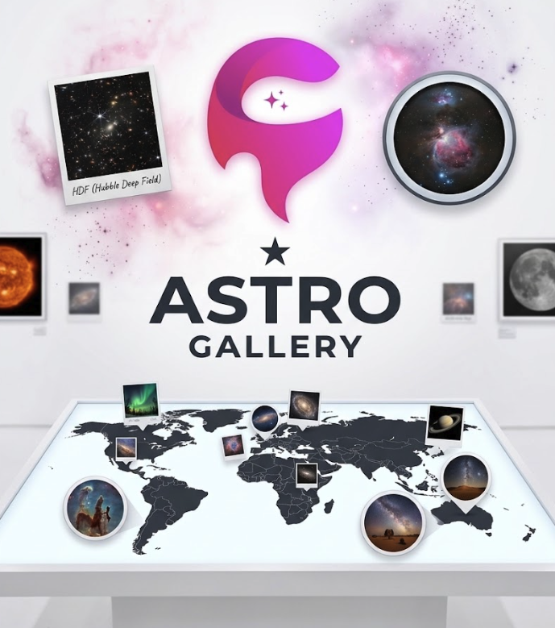

# astro-gallery



Folder-driven image galleries for [Astro](https://astro.build) — a justified
layout, a responsive grid, an **EXIF-date timeline**, and a **GDPR-friendly photo
map**. Every image goes through `astro:assets` (optimised, correctly-sized
`webp`/`avif` with `srcset`), and every component ships semantic HTML, native
lazy loading, resolved `alt` text and `ImageGallery` JSON-LD out of the box.

Point a component at a folder in `src/`, drop your photos in, done:

```astro
<JustifiedGallery folderPath="trips/rome" album="Rome, 2024" />
<ImageGallery folderPath="trips/rome" columns={4} />
<ImageTimeline folderPath="trips/rome" />
<MapGallery folderPath="trips/rome" />
```

| Component          | What it does                                                                                                                                                                                             |
| ------------------ | -------------------------------------------------------------------------------------------------------------------------------------------------------------------------------------------------------- |
| `JustifiedGallery` | Aspect-ratio-aware rows that fill the width edge-to-edge (Flickr/Unsplash style). Responsive `srcset`, blur-up skeletons, `content-visibility`, JSON-LD. Zero layout JS.                                 |
| `ImageGallery`     | Uniform responsive CSS grid, click to open a lightbox with arrow-key navigation. Also accepts an explicit `images={[…]}` list.                                                                           |
| `ImageTimeline`    | Reads each photo's EXIF capture date, groups by day and lays the days out on a timeline — a horizontal scrolling rail or a vertical spine (`<ol>` + `<time>`). Optional reverse-geocoded location label. |
| `MapGallery`       | Reads GPS EXIF, drops a circular photo marker per location on a Leaflet map. Consent gate so **no external tile request happens before the visitor agrees**; crawlable fallback.                         |

---

## Installation

```bash
npm install astro-gallery
```

`astro`, `leaflet` and `exifr` are the only runtime pieces — `leaflet` and
`exifr` are bundled as dependencies, `astro` is a peer dependency (`>=4`).

### Add the integration

```js
// astro.config.mjs
import { defineConfig } from 'astro/config';
import gallery from 'astro-gallery';

export default defineConfig({
  integrations: [
    gallery({
      // all optional — these are the defaults
      imagesDir: 'assets/images',
      locale: 'en-US',
      thumbWidth: 800,
      fullWidth: 1600,
      imageFormat: 'webp',
    }),
  ],
});
```

The integration exposes the resolved config to the components through a virtual
module; the components will not work without it.

### TypeScript

Add the virtual-module types to `src/env.d.ts` (or any `.d.ts` in your project):

```ts
/// <reference types="astro-gallery/components/virtual.d.ts" />
```

This is only needed if you import the components in `.ts`/`.tsx`; `.astro` and
`.mdx` files work without it.

---

## Usage

Import the components from `astro-gallery/components/…`:

```astro
---
import JustifiedGallery from 'astro-gallery/components/JustifiedGallery.astro';
import ImageGallery from 'astro-gallery/components/ImageGallery.astro';
import ImageTimeline from 'astro-gallery/components/ImageTimeline.astro';
import MapGallery from 'astro-gallery/components/MapGallery.astro';
---
```

In MDX the same imports work at the top of the file.

### `JustifiedGallery`

The modern one. Rows are justified to the container width using each image's
aspect ratio, so nothing is cropped to a fixed grid cell. Built for Core Web
Vitals: `srcset`/`sizes`, intrinsic `width`/`height` (no CLS), `content-visibility`
to skip offscreen work, blur-up skeletons, and the first images marked
`fetchpriority="high"`.

```astro
<JustifiedGallery
  folderPath="trips/rome"
  album="Rome, 2024"
  rowHeight={280}
  alt={{ 'piazza-navona.jpg': 'Fountain of the Four Rivers at dusk' }}
/>
```

| Prop             | Type                        | Default              | Notes                                                                |
| ---------------- | --------------------------- | -------------------- | -------------------------------------------------------------------- |
| `folderPath`     | `string`                    | –                    | Folder relative to `src/<imagesDir>/`.                               |
| `images`         | `{ src, alt?, caption? }[]` | –                    | Use instead of `folderPath` (imported image, `/public` path or URL). |
| `baseDir`        | `string`                    | `imagesDir`          | Override the base folder.                                            |
| `rowHeight`      | `number`                    | `260`                | Target row height in px (rows justify to fill the width).            |
| `gap`            | `string`                    | `1rem`               | CSS gap between items.                                               |
| `eager`          | `number`                    | `2`                  | First N images load eagerly with `fetchpriority="high"`.             |
| `lightbox`       | `boolean`                   | `true`               | Open images in the built-in lightbox.                                |
| `alt`            | `Record<string,string>`     | `{}`                 | Per-file `alt` overrides (folder mode), keyed by file name.          |
| `captions`       | `Record<string,string>`     | `{}`                 | Per-file caption overrides (folder mode).                            |
| `album`          | `string`                    | –                    | Accessible label, fallback `alt`, and JSON-LD `name`.                |
| `sizes`          | `string`                    | `1–3 col responsive` | `` attribute.                                             |
| `structuredData` | `boolean`                   | integration setting  | Emit `ImageGallery` JSON-LD.                                         |

### `ImageGallery`

**Folder mode** — every image in `src/assets/images/trips/rome/`, sorted by
filename (natural sort, so `2.jpg` before `10.jpg`):

```astro
<ImageGallery folderPath="trips/rome" columns={3} />
```

**Explicit mode** — mix `import`ed images, `/public` paths and remote URLs, and
add captions:

```astro
---
import sunrise from '../assets/sunrise.jpg';
---

<ImageGallery
  columns={2}
  images={[
    { src: sunrise, alt: 'Sunrise over the forum', caption: 'Day 1 — 05:41' },
    { src: '/photos/street.jpg', alt: 'Backstreet' },
    { src: 'https://example.com/remote.jpg', alt: 'Remote host' },
  ]}
/>
```

| Prop             | Type                        | Default     | Notes                                                                               |
| ---------------- | --------------------------- | ----------- | ----------------------------------------------------------------------------------- |
| `folderPath`     | `string`                    | –           | Folder relative to `src/<imagesDir>/`.                                              |
| `images`         | `{ src, alt?, caption? }[]` | –           | Use instead of `folderPath`. `src` is an imported image, a `/public` path or a URL. |
| `baseDir`        | `string`                    | `imagesDir` | Override the base folder for this instance.                                         |
| `columns`        | `1 \| 2 \| 3 \| 4 \| 5`     | `3`         | Columns at the widest breakpoint (scales down responsively).                        |
| `gap`            | `string`                    | `1rem`      | CSS gap between items.                                                              |
| `loading`        | `'lazy' \| 'eager'`         | `'lazy'`    | `loading` for images after the first (the first is always `eager`).                 |
| `lightbox`       | `boolean`                   | `true`      | `false` → thumbnails link straight to the full image.                               |
| `alt`            | `Record<string,string>`     | `{}`        | Per-file `alt` overrides (folder mode), keyed by file name.                         |
| `captions`       | `Record<string,string>`     | `{}`        | Per-file caption overrides (folder mode).                                           |
| `album`          | `string`                    | –           | Accessible label, fallback `alt`, and JSON-LD `name`.                               |
| `sizes`          | `string`                    | from cols   | `` attribute.                                                            |
| `structuredData` | `boolean`                   | integ.      | Emit `ImageGallery` JSON-LD.                                                        |

Without JavaScript the thumbnails are still plain links to the full-size image.

### `ImageTimeline`

```astro
<ImageTimeline folderPath="trips/rome" maxPerGroup={4} />
<ImageTimeline folderPath="trips/rome" orientation="vertical" />
```

| Prop          | Type                         | Default              | Notes                                                         |
| ------------- | ---------------------------- | -------------------- | ------------------------------------------------------------- |
| `folderPath`  | `string`                     | – (required)         | Folder relative to `src/<imagesDir>/`.                        |
| `baseDir`     | `string`                     | `imagesDir`          | Override the base folder.                                     |
| `locale`      | `string`                     | integration `locale` | Date-label locale.                                            |
| `maxPerGroup` | `number`                     | `4`                  | Thumbnails per day before a `+N` tile.                        |
| `orientation` | `'horizontal' \| 'vertical'` | `'horizontal'`       | Horizontal scrolling rail, or a vertical spine down the page. |
| `geocode`     | `boolean`                    | integration setting  | Reverse-geocode one location label per day.                   |
| `scrollHint`  | `string`                     | `'Scroll for more'`  | Hint under a **horizontal** timeline; `""` hides it.          |
| `alt`         | `Record<string,string>`      | `{}`                 | Per-file `alt` overrides, keyed by file name.                 |
| `album`       | `string`                     | –                    | Accessible label and fallback `alt`.                          |

Photos with no EXIF date collapse into a single trailing group (label
configurable via the integration's `undatedLabel`).

### `MapGallery`

```astro
<MapGallery folderPath="trips/rome" />
```

Images **without** GPS EXIF are silently skipped; if none of the photos have GPS
the component renders nothing.

| Prop                                                  | Type                      | Default                     | Notes                                                    |
| ----------------------------------------------------- | ------------------------- | --------------------------- | -------------------------------------------------------- |
| `folderPath`                                          | `string`                  | – (required)                | Folder relative to `src/<imagesDir>/`.                   |
| `baseDir`                                             | `string`                  | `imagesDir`                 | Override the base folder.                                |
| `locale`                                              | `string`                  | integration `locale`        | Popup date locale.                                       |
| `geocode`                                             | `boolean`                 | integration setting         | Reverse-geocode a label per marker.                      |
| `basemap`                                             | `BasemapId`               | `'osm'`                     | Named tile preset (see below).                           |
| `scheme`                                              | `'auto'\|'light'\|'dark'` | `'auto'`                    | Force the control chrome light/dark, or follow the page. |
| `tileUrl`                                             | `string`                  | from `basemap`              | Leaflet XYZ tile template; overrides `basemap`.          |
| `tileAttribution`                                     | `string`                  | from `basemap`              | Attribution HTML.                                        |
| `tileApiKey`                                          | `string`                  | –                           | Key appended to tile requests (CARTO, Stadia…).          |
| `tileApiKeyParam`                                     | `string`                  | `api_key`                   | Query-param name for `tileApiKey`.                       |
| `consent`                                             | `boolean`                 | `true`                      | Show the consent gate before loading tiles.              |
| `consentKey`                                          | `string`                  | `astro-gallery:map-consent` | `localStorage` key for the choice.                       |
| `consentTitle` / `consentText` / `consentButtonLabel` | `string`                  | English defaults            | Consent gate copy (`consentText` allows HTML).           |
| `alt`                                                 | `Record<string,string>`   | `{}`                        | Per-file `alt` overrides, keyed by file name.            |
| `album`                                               | `string`                  | –                           | Accessible label, fallback `alt`, JSON-LD name.          |
| `structuredData`                                      | `boolean`                 | integration setting         | Emit `ImageGallery` JSON-LD.                             |

Even with the map, an SSR-rendered `<ul>` of linked thumbnails (with `alt`,
`width`/`height` and `loading="lazy"`) sits inside the container for crawlers and
no-JS visitors; the client script removes it once the interactive map is built.

#### The consent gate

Map tiles are fetched from a third-party CDN, which exposes the visitor's IP
address. By default `MapGallery` renders an overlay explaining this and loads
**nothing** from the network until the visitor clicks the button. The decision
is stored in `localStorage` under `consentKey`. Set `consent={false}` (or
`map.consent: false` on the integration) to opt out of the gate — e.g. if you
self-host tiles.

#### Basemap themes

Pick a look with `basemap` (integration `map.basemap` or the `MapGallery` prop) —
it fills in the tile URL, attribution, zoom and control-chrome scheme:

| `basemap`         | Style                      | Chrome | Key? |
| ----------------- | -------------------------- | ------ | ---- |
| `osm` _(default)_ | OSM standard               | light  | no   |
| `carto-dark`      | CARTO dark matter          | dark   | yes  |
| `carto-light`     | CARTO positron             | light  | yes  |
| `carto-voyager`   | CARTO voyager              | light  | yes  |
| `stadia-dark`     | Stadia Alidade Smooth Dark | dark   | yes  |
| `esri-satellite`  | Esri world imagery         | dark   | no   |

```js
// astro.config.mjs
gallery({
  map: {
    basemap: 'carto-dark',
    tileApiKey: process.env.CARTO_API_KEY, // free key: https://carto.com/basemaps/apikey/
  },
});
```

```astro
<!-- or per instance -->
<MapGallery folderPath="trips/rome" basemap="esri-satellite" />
```

The preset also sets `scheme` (`"light"` / `"dark"`) so the popups, zoom buttons
and attribution match the tiles even on a page with the opposite theme. Override
with the `scheme` prop, or `"auto"` to follow the page.

#### Custom tile providers & API keys

`tileUrl` overrides any `basemap`. `tileApiKey` is appended to every tile request
as `?<tileApiKeyParam>=<key>` — default param `api_key` (CARTO, Stadia); MapTiler
uses `key`, Thunderforest `apikey`.

```js
gallery({
  map: {
    tileUrl: 'https://api.maptiler.com/maps/streets-v2/{z}/{x}/{y}.png',
    tileApiKey: process.env.MAPTILER_KEY,
    tileApiKeyParam: 'key',
    tileAttribution: '&copy; MapTiler &copy; OpenStreetMap contributors',
  },
});
```

Tile keys are requested from the browser, so use a **domain-restricted** key — it
will be visible in page source.

---

## Captions

Captions render as a `<figcaption>` (always visible in `ImageGallery`, revealed
on hover/focus in `JustifiedGallery`) and also feed the lightbox caption and the
JSON-LD `caption`. Three ways to set them:

**Folder mode — the `captions` prop** (`JustifiedGallery`, `ImageGallery`). A map
of _file name_ → caption; files you omit have none:

```astro
<JustifiedGallery
  folderPath="trips/rome"
  captions={{
    '05-piazza-navona.jpg': 'The Fountain of the Four Rivers at dusk',
    '09-gianicolo-sunset.jpg': 'Golden hour from the Gianicolo hill',
  }}
/>
```

**Explicit mode — the `caption` field** on each entry:

```astro
<ImageGallery
  images={[
    { src: navona, alt: 'Fountain of the Four Rivers', caption: 'Day 2 — Piazza Navona at dusk' },
    { src: '/photos/street.jpg', alt: 'A quiet backstreet' },
  ]}
/>
```

**Embedded in the file.** `JustifiedGallery` (folder mode) falls back to an
image's own IPTC / XMP caption when it has one and it differs from the `alt`.
Set it with any photo app's _Caption_ field, or exiftool:

```bash
exiftool -IPTC:Caption-Abstract="Golden hour from the Gianicolo hill" 09-sunset.jpg
```

The `captions` prop always wins over an embedded caption. `JustifiedGallery`
captions are hidden until hover/focus — to always show them, add
`.asg-jgallery__caption { opacity: 1 }` to your CSS.

`ImageTimeline` and `MapGallery` don't take per-photo captions; they show the
reverse-geocoded location (and date) instead.

---

## Integration options

```ts
gallery({
  imagesDir: 'assets/images', // folderPath is resolved against src/<this>/
  locale: 'en-US', // every date label
  thumbWidth: 800, // px, passed to astro:assets
  fullWidth: 1600, // px, the "full" image behind the lightbox
  imageFormat: 'webp', // 'webp' | 'avif' | 'jpeg' | 'png'
  undatedLabel: 'Undated',
  responsiveWidths: [400, 640, 960, 1280, 1920], // srcset candidate widths
  structuredData: true, // emit ImageGallery / ImageObject JSON-LD

  map: {
    basemap: 'osm', // 'osm' | 'carto-dark' | 'carto-light' | 'carto-voyager' | 'stadia-dark' | 'esri-satellite'
    scheme: 'auto', // 'auto' | 'light' | 'dark' — control-chrome colour
    // tileUrl / tileAttribution / subdomains / maxZoom come from `basemap`;
    // set them here to override the preset.
    tileApiKey: undefined, // required by carto-* / stadia-dark (and MapTiler, …)
    tileApiKeyParam: 'api_key',
    consent: true,
    consentKey: 'astro-gallery:map-consent',
    consentTitle: 'Map view',
    consentText: 'Loading the map requests map tiles from an external provider…',
    consentButtonLabel: 'Load map',
  },

  geocode: {
    enabled: true,
    endpoint: 'https://nominatim.openstreetmap.org/reverse',
    userAgent: 'astro-gallery (https://github.com/you/your-repo)',
    language: 'en',
    cachePath: '.cache/astro-gallery/geocode.json',
    minRequestIntervalMs: 1200,
  },
});
```

### Reverse geocoding & the cache

`ImageTimeline` and `MapGallery` turn GPS coordinates into place names at build
time using [Nominatim](https://nominatim.org/). Results are written to
`geocode.cachePath` (rounded to a ~11 km grid so nearby photos share a lookup).

**Commit that cache file.** Once it exists, builds — including CI — never touch
the network. Nominatim's [usage policy](https://operations.osmfoundation.org/policies/nominatim/)
asks for a real `User-Agent` and ≤ 1 request/second; the defaults respect this,
but set your own `userAgent`. To disable geocoding entirely: `geocode: { enabled: false }`.

---

## Theming

All markup is namespaced under `.asg-*` and driven by CSS custom properties. The
stylesheet loads automatically with the components. Override the tokens
anywhere in your global CSS:

```css
:root {
  --asg-accent: #e11d48;
  --asg-radius: 1rem;
  --asg-gap: 1.5rem;
  --asg-surface: #0b0b0f;
  --asg-border: rgba(255, 255, 255, 0.1);
  --asg-text: #fafafa;
  --asg-text-muted: #a1a1aa;
}
```

Light mode is picked up from `prefers-color-scheme` automatically. Force a mode
with `data-asg-theme="light"` / `"dark"` on `<html>`. You can also import the
stylesheet yourself (it is idempotent):

```astro
import 'astro-gallery/styles.css';
```

---

## SEO & accessibility

Every component renders crawlable, accessible markup on the server — the
JavaScript only enhances it.

- **Semantic HTML.** Galleries are a `<ul role="list">` of `<li><figure>`; each
  thumbnail is a real `<a href>` to the full-size image (so crawlers can follow
  it) with an `` and an optional `<figcaption>`. The timeline is a
  `<section>` containing an `<ol>` where each day's heading is a
  `<time datetime="YYYY-MM-DD">`.
- **`alt` text that isn't a file name.** For folder mode the `alt` is resolved
  in this order: an explicit value you pass via the `alt` prop → an embedded
  caption from the image (IPTC `Caption`, XMP `dc:description`, EXIF
  `ImageDescription`) → a humanised file name (`01-trevi-fountain.jpg` →
  “Trevi fountain”, camera names like `IMG_4821.JPG` are ignored) → `"<album> —
photo N"`. Name your files well or pass `alt={{ 'file.jpg': '…' }}` and you get
  good alt text for free.
- **Lazy loading without layout shift.** Every `` carries intrinsic
  `width`/`height`, `loading="lazy"` and `decoding="async"`. The first image
  (or first `eager` images in `JustifiedGallery`) is `loading="eager"` +
  `fetchpriority="high"` for LCP. `JustifiedGallery` adds `content-visibility`
  so offscreen rows cost nothing.
- **Responsive images.** `ImageGallery` and `JustifiedGallery` emit a
  `srcset` across `responsiveWidths` (never upscaling past the source) with a
  matching `sizes`.
- **Structured data.** Each gallery emits one
  `<script type="application/ld+json">` with an `ImageGallery` whose
  `associatedMedia` is a list of `ImageObject`s (`contentUrl`, `thumbnailUrl`,
  `name`, `caption`, `width`, `height`). Relative URLs become absolute when
  `site` is set in `astro.config`. Disable globally with
  `structuredData: false`, or per component with the `structuredData` prop.
- **`MapGallery` stays indexable.** The photos live in an SSR `<ul>` of linked
  thumbnails inside the map container; the client script swaps in the Leaflet
  map (and removes that list) only after consent. No-JS visitors and crawlers
  get the thumbnail list; the marker ``s and popups also carry real `alt`.
- **Reduced motion & no-JS.** Hover zoom, blur-up shimmer and fade-ins are
  gated behind `prefers-reduced-motion` and `@media (scripting: enabled)`, so
  images are always visible without JavaScript.

---

## How it works

- **Image discovery** uses `import.meta.glob('/src/**/*.{jpg,png,…}', { eager: true })`
  inside the components, so Astro sees every candidate at build time and can
  optimise it. `folderPath` just filters that set by prefix.
- **EXIF** is read from the original bytes with [`exifr`](https://github.com/MikeKovarik/exifr)
  during SSR only — nothing EXIF-related ships to the browser.
- **The lightbox** is ~2 kB of dependency-free JS, re-initialised on
  `astro:page-load` / `astro:after-swap` so it survives View Transitions.
- **Leaflet** is imported in a client `<script>`, so the map library is only
  downloaded on pages that actually use `MapGallery` — and only after consent.

---

## Requirements

- Astro 4, 5, 6 or 7 (peer dependency `astro >=4`)
- Node 18.17+ — but whatever your Astro version needs wins (Astro 7 requires Node
  22.12+). Contributing to this repo needs Node 20+.
- Images stored under `src/` (not `public/`) so `astro:assets` can process them —
  the explicit `images={[…]}` list on `ImageGallery` is the exception and accepts
  `public/` and remote URLs.

---

## Contributing

See [CONTRIBUTING.md](./CONTRIBUTING.md). There is a runnable playground in
[`demo/`](./demo) — `npm run demo` from the repo root.

## License

[MIT](./LICENSE) © SlashGordon
